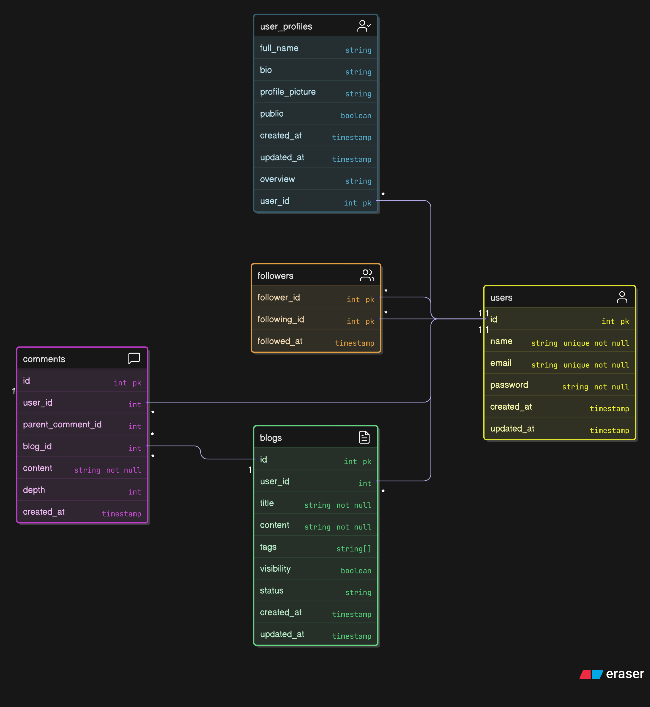

# Neo Logs - The Blogging Platform 

<h2> Please find the link to the backend of the Blogging Platform <a href='https://github.com/k-srirama-srikar/neo-logs-backend'> here</a> </h2>

## Tech stack involved

| | |
| --- | --- |
| Frontend | ReactJS |
| Backend | Go |
| Database | PostgreSQL |

Some prominent libraries used in each of the languages are:
- `React Axios` for HTTP methods like `POST`, `GET`, `PUT` etc...
- `Go Fiber` to ensure proper routing for each of the HTTP methods
- `JWT` for user authentication and login
- `Go pgxpool` for Postgres querying

## What does the Blogging Platform entail

- Neo Logs gives users the feasibility to post blogs that are markdown supported, add some tags for the same
- Users can comment under the blog (nested comment upto a depth of 5) and engage in discussions of some sort
- Users can follow each other
- Users can configure their profiles to their liking

## The reason behind the making of this

One of the main reasons was to explore how a backend system functions and as such and I, personally, wanted to explore Golang, which was at that time a new language to me.

So the backend of this is pretty robust, in the sense that I have tried to make the schema pretty properly indicate dependancies and make sure that every table is consistent with every other table present in the schema.

There are still a lot of features that can be implemented, but that's probably for another day

## Schema of the Database

Above is the ER diagram made using eraser

## The walkthrough of the Blogging Platform can be found [here](https://github.com/k-srirama-srikar/Neo-Logs/blob/main/Walkthrough/README.md)