## Walkthrough Blogging Platform

> [!CAUTION] 
> Please be mindful of the UI as this was supposed to be a project made for exploratory and learning purposes 

The below is the initial home page that we encounter
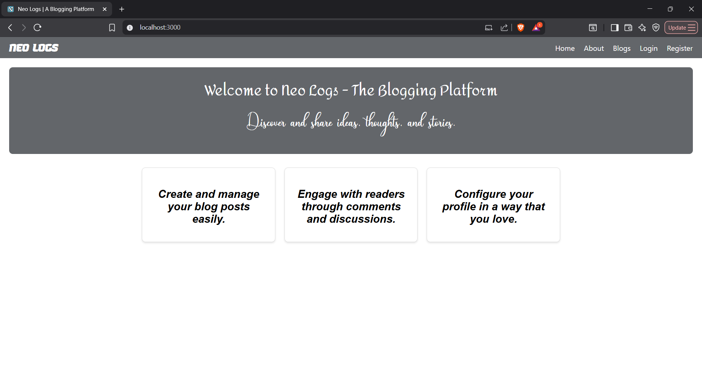

Now we can either login or register (we can also see the blogs that are present as well by clicking on the blogs button)...

Say we register intially, we get the following page and we enter our details

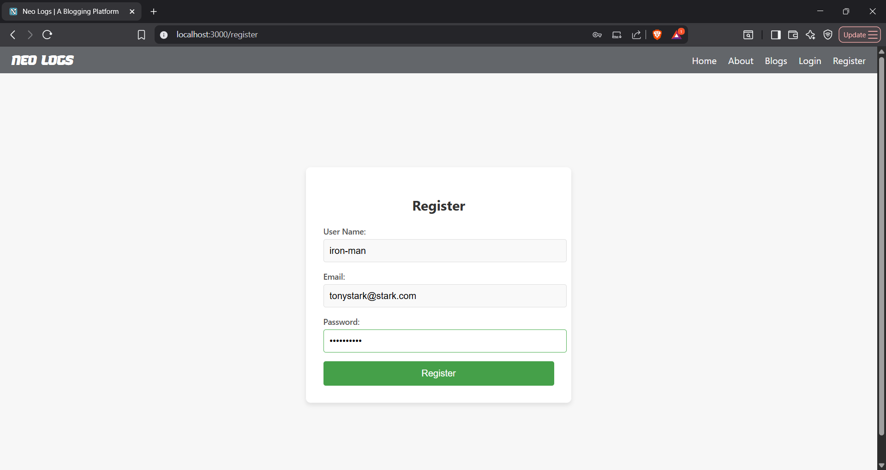

After registering we are redirected to the login page.

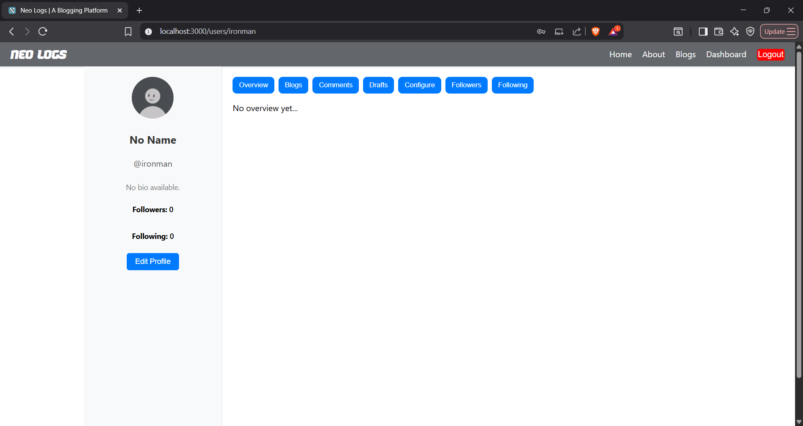

We see the above page after logging in and the default profile pic and the other details are automatically filled into the `user_profile` table using a trigger that's called after the user has registered. 

Now the user has the option to explore multiple blogs or to configure his profile or to post a blog of his own!

Lets say that the user now wants to configure his profile, he clicks on the configure tab, note that the edit profile button in the sidebar redirects to the configure tab as well.

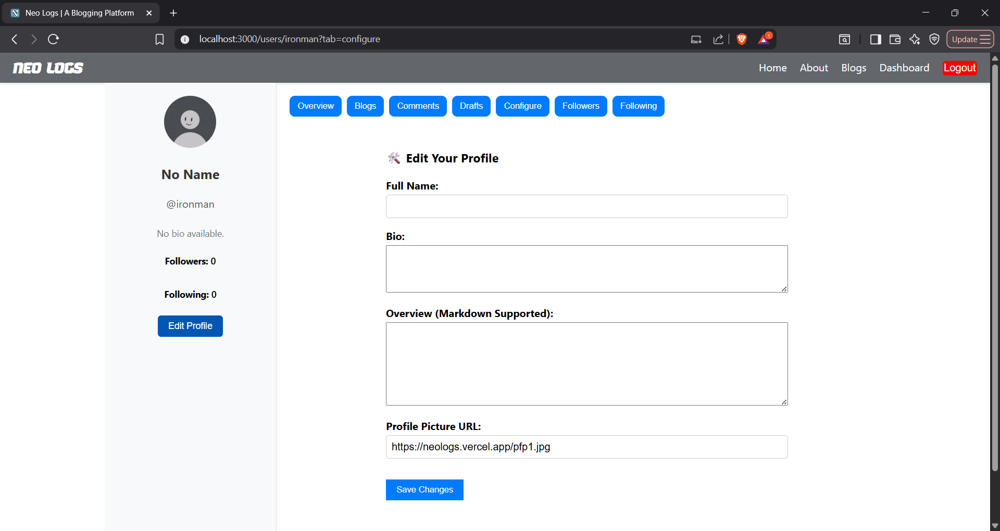

Now we configure it and achieve the below

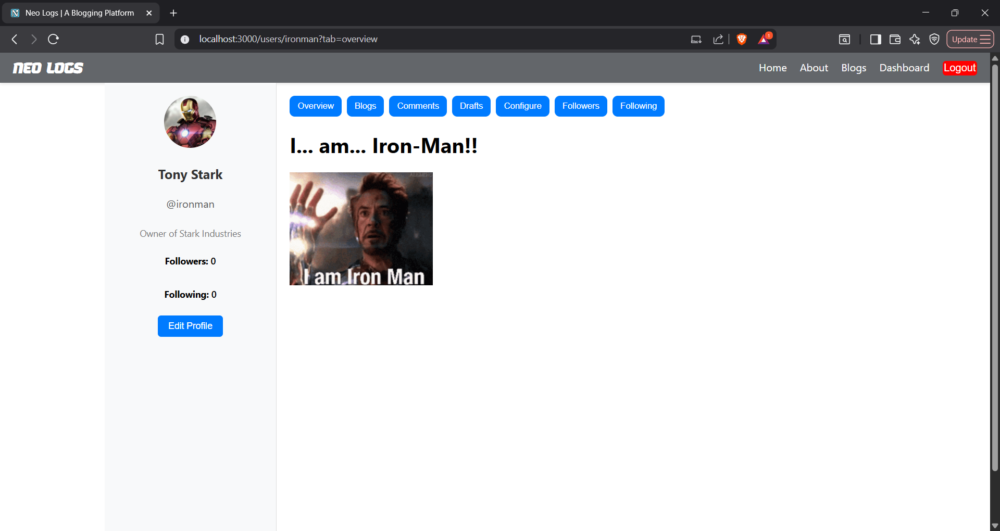

So now we can dive into the core functionality, that is blogging, we can either go to the blog tab in the user profile or the blogs in the header which presents us with an option to post blogs. But the idea is that one lets us view the blogs posted by the user and the other all the publicly posted blogs

Say lets go the Blogs page

We see all the blogs listed 

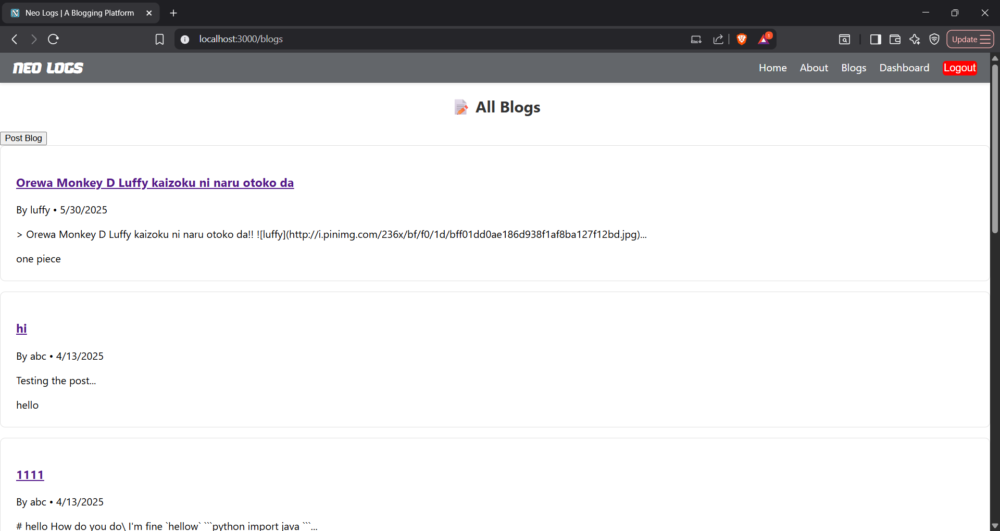

We can see all the blogs that are posted

Now lets see a blog and the comments in a zoomed out version

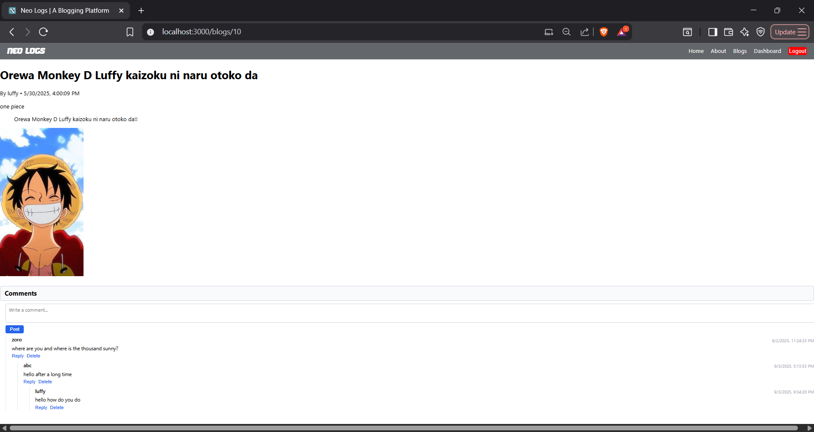

Now we can engage in some discussions here and see how things go on

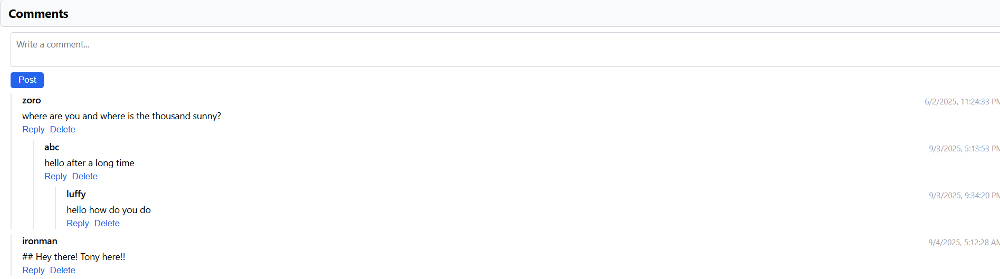

And we can pretty much see the things going on

Now lets move on to posting a blog, we have an editor like the below, inspired from leetcode (lol)

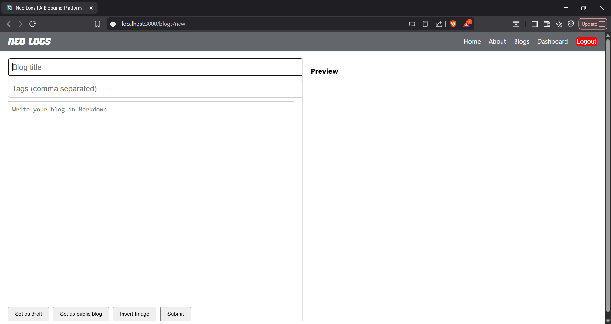

Now we write the following and make the blog public (also we can se that the blog has a live preview)

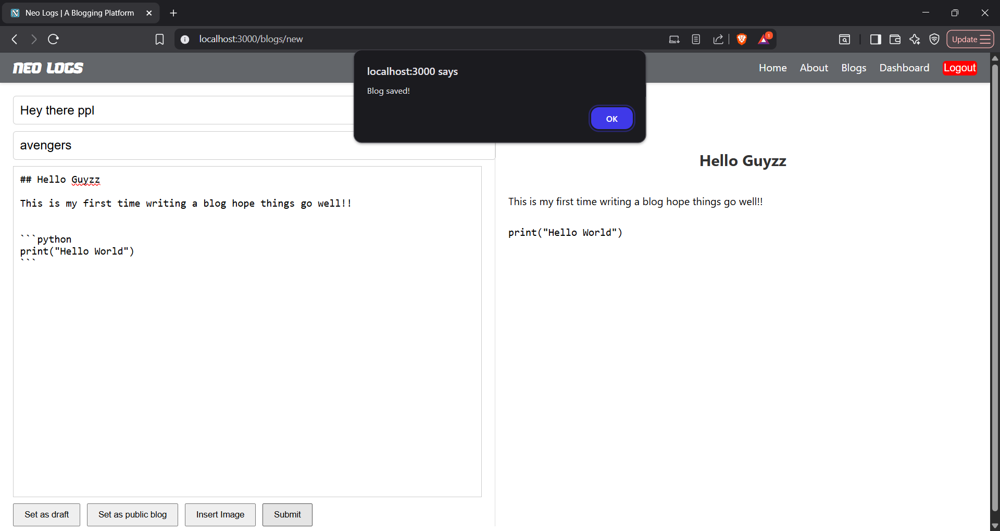

We can see that this will be displayed in the blogs and also in the blogs tab in the dashboard

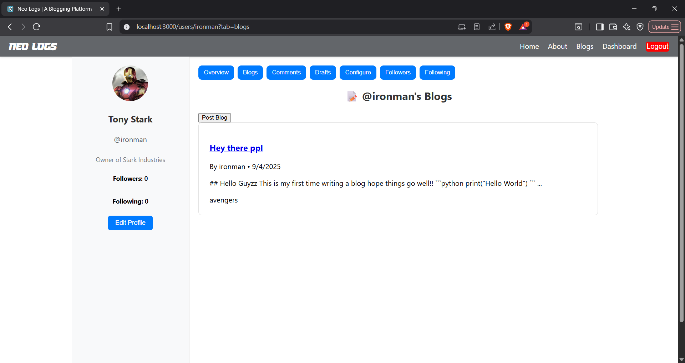

Also similarly we can see the comments as well

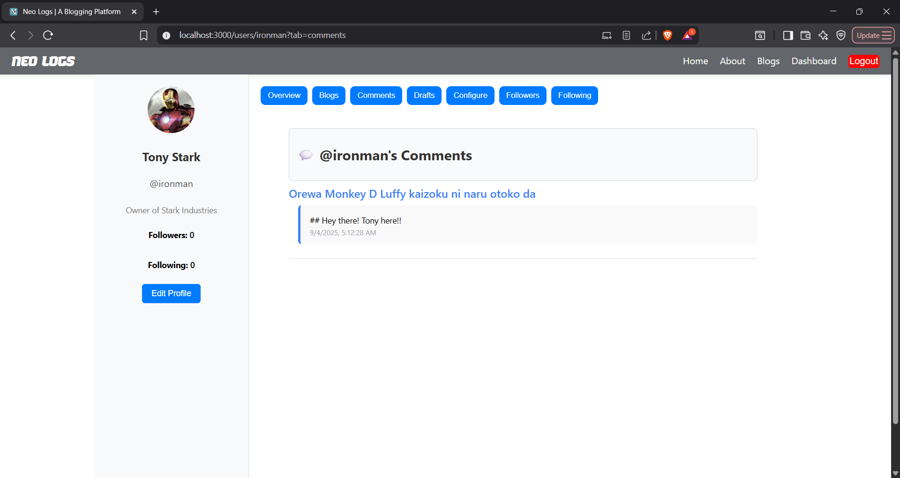

Now we can find some other profiles and follow or unfollow them...

Say now we follow the profile named luffy

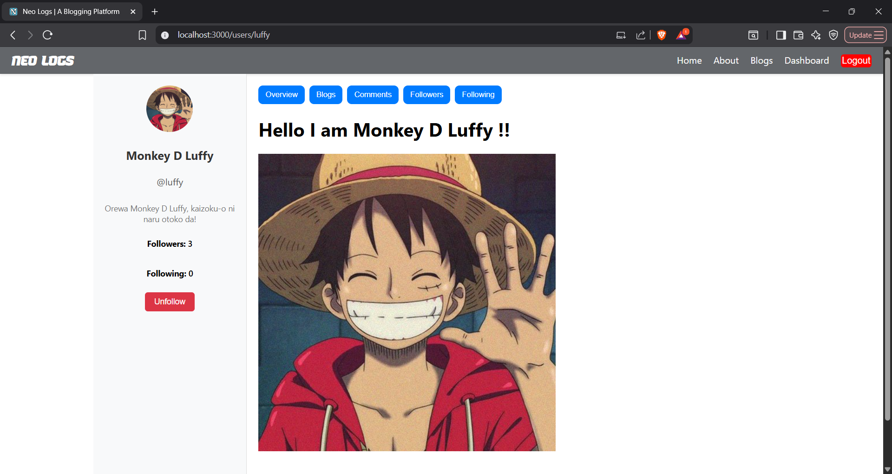

Now we can see in the following that we have successfully added him

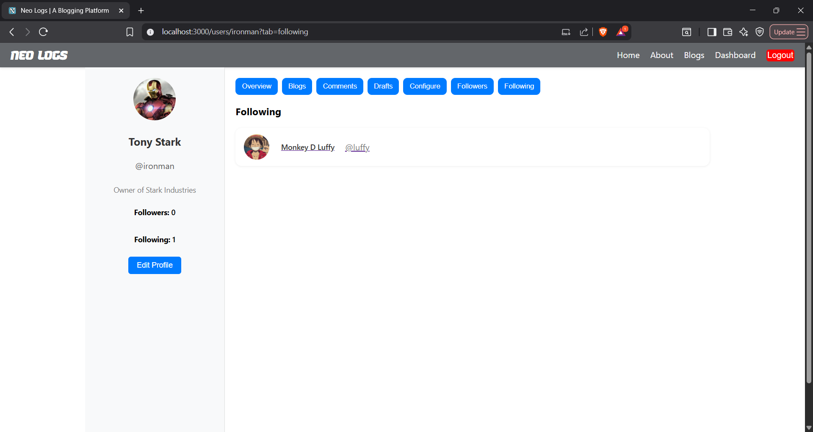

And similarly, we can also notice that the count has also been incremented as well

---

Well that's pretty much all I was able to write here, although honestly it was quite a struggle to implement this in the backend, trying to figure out all the possible edge cases where the setup might fail